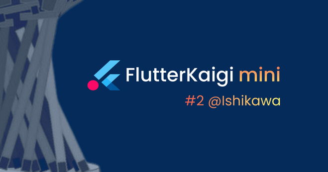

# Flutter アプリ インフラ入門（Dependency Injection）

このリポジトリは、**[FlutterKaigi mini #2 @Ishikawa](https://flutterkaigi.connpass.com/event/325469/)** のミニハンズオン資料となっています。

## ミニハンズオンについて
このミニハンズオンは、 Flutterでアプリを作ってみたので、  
これから大勢の人のためのアプリを作ろうと思われている初心者の方を対象としています。

では **「大勢の人が使うアプリとは何で、何が必要」** なのでしょうか。  

　_” 事業者から見れば、アプリは事業を継続発展させるためのツールでしょう。_  
　_このため事業の成長によるスケールアップ、信頼性確保のための高品質化、_  
　_ニーズの変化による方針変更から、継続改修できることが求められます。_

　_**解りやすく変更や拡張を容易にする設計が大切**なのはこのためです。”_  
　_[Flutter Festival 2022 資料](docs/pdf/GDSC-keio_Flutter_Festival_2022.pdf)より引用_

これは、「品質を上げ、変更による不具合を早期発見する」ためのテストや、  
「想定外エラーが発生しても、安全にアプリを止めるためのエラーハンドラ」や、  
「エラーやユーザニーズの変化に気づくためのログ記録」...など  
1. **目に見える機能要件** とは別視点の
2. **事業要件を満たす仕組み** も必要であることを物語っています。

このミニハンズオンでは、事業要件のテストやログ出力に役立つ、  
簡易コードによる依存性注入(DIコンテナ)について体験してもらいます。  

## ミニハンズオンに必要なもの
1. PCに Flutter開発環境をインストールしておいてください。（①参照）  
  _モバイルアプリ開発に必要な Android SDK などのインストールは任意です。_  
  _この Git リポジトリをクローンするため、`git`のインストールも必要です。_

2. PC に Flutter開発環境をインストールされていなければ、  
  Webブラウザで利用できる [DartPad](https://dartpad.dev/)を御利用ください。  
  _テストコードの実行はできませんが、動作確認のみであれば利用できます。_

- ①[Install | Flutter](https://docs.flutter.dev/get-started/install)
- ②[DartPad](https://dartpad.dev/) ⇒ ブラウザ上で利用できる、簡易オンライン Flutter IDE

## ミニハンズオンの進めかた

## [Flutter Brand Guidelines](https://docs.flutter.dev/brand#community-use-exceptions)
- “Flutter and the related logo are trademarks of Google LLC. FlutterKaigi is not affiliated with or otherwise sponsored by Google LLC.”
- "Flutterおよび関連するロゴは、Google LLC の商標です。FlutterKaigi は、Google LLC との提携および、Google LLC が後援しているものでもないことに御留意下さい。”