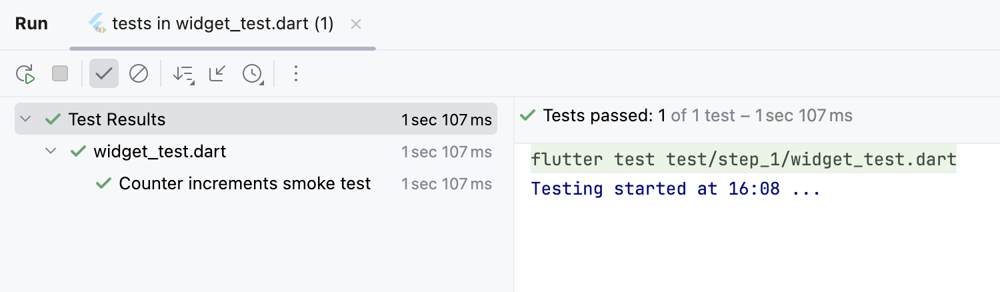

# step1: デフォルト・カウンターアプリのコード

## コード内容確認
`flutter create`コマンドで作られた カウンターアプリのコードを確認します。  

- ブラウザあるいは IDEで、この`README.md`と同じディレクトリにある [lib/src/step_1/counter_page.dart](./counter_page.dart) を開きます。


### コード確認ポイント
```dart
  int _counter = 0;
```
- カウント値は、初期値 `0`のプライベート変数 `_counter`にバインドされているため外部から干渉されない。（カプセル化）

```dart
  void _incrementCounter() {
    setState(() {
      _counter++;
    });
  }
```
- カウント値の更新は、プライベート関数 `_incrementCounter`からしかないため外部から干渉されない。（カプセル化）
- カウント値の更新は、プライベート関数 `_incrementCounter`によるインクリメント(+1 更新)しかできない。

**キーポイント**  
- カウント値と更新関数は、  
  `_MyHomePageState`クラス内部に閉じられたカプセル化により、クラス内部からしか参照できない。  
  これはアプリ内でカウント値の都合を知る`_MyHomePageState`クラスにのみアクセスを制限することで、  
  **アプリ内で、カウント値が不正にならない** ことを保証している。  


### アプリ実行
- FAB(`+`)をタップすると、画面中央のカウント値が＋１される。


## テストコード確認
ブラウザか IDEで、step_1のテストコード ⇒ [test/step_1/widget_test.dart](../../../test/step_1/widget_test.dart) を確認します。


### テストコード確認ポイント
```dart
    // Verify that our counter starts at 0.
    expect(find.text('0'), findsOneWidget);
    expect(find.text('1'), findsNothing);
```
- 初期値が `0`である。

```dart
    // Tap the '+' icon and trigger a frame.
    await tester.tap(find.byIcon(Icons.add));
    await tester.pump();

    // Verify that our counter has incremented.
    expect(find.text('0'), findsNothing);
    expect(find.text('1'), findsOneWidget);
```
- タップで `1`になる。（カウント値が +1される）


### テストコード実行

テスト実行結果  

- テストに成功した事はわかりますが、テストされたときのカウント値はわかりません。


## 課題
1. カプセル化されたカウント値は、アプリ内で 0から 1ずつ加算されていくことが保証されています。  
  ですが「カウントが 100になったときにイースターエッグを出す」などの要件をテストするには、  
  0から100までのインクリメントが必要です。

2. テストに成功した事はわかりますが、テストされたときのカウント値はわかりません。
