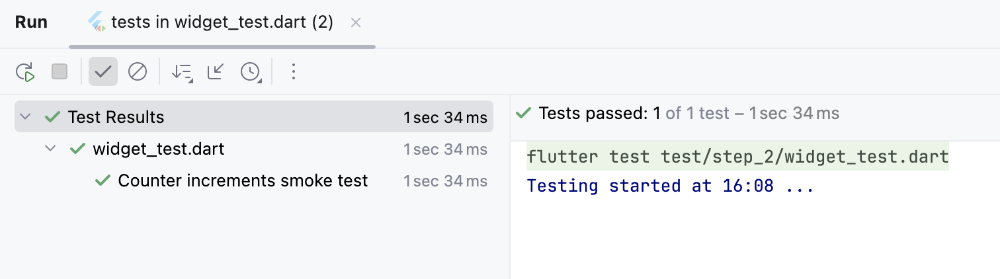

# step.2:カウンター機能(状態オブジェクト)を コンテナに生成させる。

- 依存を分離するため、カウンター機能（状態オブジェクト）を、DI コンテナから取得させます。
- 状態オブジェクトを直接生成（ハードコード）していませんが、DIコンテナはまだ依存注入に対応していません。


## ハンズオン作業前のコード内容確認
ハンズオン作業前(コードの追加修正前)のコード内容は、`step_1` をベースにしています。  
このため [lib/src/step_2/counter_page.dart](./counter_page.dart) のコード内容は、`step_1` と同じです。  
[lib/src/step_2/counter_di.dart](./counter_di.dart) には、カウント機能の依存元や DIコンテナのコードを追加します。  

- IDEで、この`README.md`と同じディレクトリにある [lib/src/step_2/counter_di.dart](./counter_di.dart) と、  
  [lib/src/step_2/counter_page.dart](./counter_page.dart) を開いてください。  
  _`DartPad`を使われている方は、ブラウザで開いてください。_  


## ハンズオン作業<br/>依存元と DIコンテナ(依存注入なし)のクラスを追加する。

### カウンタ要件となる、機能仕様インターフェースの定義
- IDEで [counter_di.dart](./counter_di.dart) を開いて、まずはカウンタの要件 ⇒ 機能仕様インターフェースを定義します。  
  _`DartPad`を使われている方は、ブラウザで [lib/src/step_2/dartpad.dart](./dartpad.dart) を開いて、_  
  _全コードをクリップボードにコピーしてから、ブラウザの [DartPad](https://dartpad.dev) にペーストしてください。_  

カウンター・アプリでは、画面にカウント値を表示して、`FAB(＋)`タップごとにカウント値が +1 ⇒ インクリメントされます。  
これよりカウンタの機能要件は、カウント値の`getter/setter`と、`increment`があれば良いことになります。  

このため空インターフェース`Counter`に、カウンタの機能仕様を追加します。

**【修正前】**
```dart
/// 機能仕様の依存元 - Counter オブジェクトの基底インターフェース
abstract interface class Counter {
}
```

**【修正後】**
```dart
/// 機能仕様の依存元 - Counter オブジェクトの基底インターフェース
abstract interface class Counter {
  int get count;

  set count(int value);

  void increment();
}
```


### DIコンテナで依存注入できるよう、依存元と注入先のインターフェースの定義
- つづいて、DIコンテナで依存注入できるようにするため、依存元と注入先の基底インターフェースを定義します。

カウンタの機能仕様インターフェースのカウンタ機能実装クラスを作る前に、  
DIコンテナで機能実装を依存先に注入できるようにするため、**依存元**と**注入先**の基底インターフェースを定義します。  

DIコンテナについては、DIコンテナの基本機能を提供する  
**インフラ・ライブラリ([lib/src/infra/dependency_injector.dart](../infra/dependency_injector.dart))** を用意しておきました。

予め **依存元**の`ReferencableCounter`と **注入先**の`InjectableCounter`のインターフェースを定義していますが、  
DIコンテナのインフラ・ライブラリ([dependency_injector.dart](../infra/dependency_injector.dart))と連携するよう修正してください。  

**【修正前】**
```dart
/// 機能実態の注入先 -  Counter オブジェクト注入先の基底インターフェース
abstract interface class InjectableCounter {}

/// 機能挙動の依存元 - Counter オブジェクトの基底インターフェース
abstract interface class ReferencableCounter {}
```

**【修正後】**
```dart
/// 機能実態の注入先 -  Counter オブジェクト注入先の基底インターフェース
abstract interface class InjectableCounter implements ReferencableCounter, Injectable<ReferencableCounter> {}

/// 機能挙動の依存元 - Counter オブジェクトの基底インターフェース
abstract interface class ReferencableCounter implements Counter, Referencable {}
```


### カウンタ要件(機能仕様)を実現する、機能実装クラスの定義
- カウンタの機能仕様を実現する、カウンタ機能実装クラスを定義します。

予め **カウンタの機能実装(依存元)** の `CounterImpl`クラスを定義していますので、これに実装を追加します。  
_DIコンテナのインフラ・ライブラリ([dependency_injector.dart](../infra/dependency_injector.dart))と連携するよう、
`AbstractReferencable`抽象クラスを継承させてください。_

**【修正前】**
```dart
/// DI から依存元として参照可能な Counter クラス
class CounterImpl implements ReferencableCounter {}
```

**【修正後】**
```dart
/// DI から依存元として参照可能な Counter クラス
class CounterImpl extends AbstractReferencable implements ReferencableCounter {
  // ignore: prefer_final_fields
  late int? _value;

  /// プライベート・コンストラクタ
  ///
  /// _DI コンテナを介してしか生成できないことに留意_
  CounterImpl._() {
    _value = 0;
  }

  @override
  int get count => _value!;

  @override
  set count(int value) => _value = value;

  @override
  void increment() => count++;
}
```


### オブジェクトを生成させる、DIコンテナ(依存注入なし)のクラスの定義
- カウンタ機能実装オブジェクトを生成させる DIコンテナを定義します。

カウンタ機能実装クラスは、その生成を DIコンテナに集約させるよう、プライベート・コンストラクタになっています。  
この集約制限により、カウンタ機能オブジェクトを生成させるため、DIコンテナの実装クラスを定義します。  

ただし現時点では、**依存元**のカウンタ機能実装クラスを定義しましたが、**注入先**クラスは定義していません。  
このため、定義する DIコンテナの実装クラスは、**オブジェクトの生成ができても依存注入はできない**ことに注意ください。  

予め **カウンタ機能の DIコンテナ** の `CounterDiContainer`クラスを定義していますので、これに実装を追加します。  
_DIコンテナのインフラ・ライブラリ([dependency_injector.dart](../infra/dependency_injector.dart))と連携するよう、  
`AbstractDependencyInjector`抽象クラスを継承させてください。_

**【修正前】**
```dart
/// Counter オブジェクトの DIコンテナ・クラス
class CounterDiContainer {}
```

**【修正後】**
```dart
/// Counter オブジェクトの DIコンテナ・クラス
class CounterDiContainer extends AbstractDependencyInjector<Counter, ReferencableCounter, InjectableCounter> {
  /// シングルトン・インスタンス
  static CounterDiContainer? _singletonInstance;

  /// シングルトン・ゲッター
  static CounterDiContainer get singleton {
    if (_singletonInstance == null) {
      _singletonInstance = CounterDiContainer._();
      return _singletonInstance!;
    }
    return _singletonInstance!;
  }

  /// プライベート・コンストラクタ
  CounterDiContainer._();

  /// Counter オブジェクト生成
  @override
  Counter create() {
    // オブジェクトを生成しますが、Dependency Inject は利用できません。
    CounterImpl counter = CounterImpl._();
    super.addContainer(counter.id, counter);
    return counter;
  }

  /// 使用禁止
  @override
  void addContainer(int id, Counter object) {
    throw DefaultError('This method can use to only from the create method.');
  }
}
```

**【追加インポート】**
```dart
import '../infra/default_error.dart';
import '../infra/dependency_injector.dart';
```
_`DartPad`では、追加不要です。_


## ハンズオン作業<br/>カウンタ画面のコードを修正する。

### カウンタ画面における、DIコンテナを使ったオブジェクト生成
- IDEで [counter_page.dart](./counter_page.dart) を開いて、DIコンテナを利用するように修正します。  
  _`DartPad`を使われている方は、引き続きブラウザで作業を続けてください。_

カウンター・アプリでのカウント機能は、  
カウント値を int型のプライベート変数 `_counter`で管理して、`_incrementCounter`メソッドでインクリメントしていました。  

DIコンテナでのカウンタ機能は、  
カウンタ機能仕様インターフェース(`Counter`)を実装した、 カウンタ機能実装クラス(`CounterImpl`)に依存させています。  
このため `_counter`を`Counter`型にして、`_incrementCounter`メソッドの修正を行います。

**【修正前】**
```dart
  int _counter = 0;
```

```dart
  void _incrementCounter() {
    setState(() {
      _counter++;
    });
  }
```

**【修正後】**
```dart
  late Counter _counter;
```

```dart
  void _incrementCounter() {
    setState(() {
      _counter.increment();
    });
  }
```

`_counter`フィールドは、  
カウンタ機能仕様インターフェース(`Counter`)に修正したので、機能実態オブジェクトをバインドする必要があります。  
そしてカウンタ機能実装クラス(`CounterImpl`)のオブジェクト生成は、DIコンテナに集約生成させるようにしたので、  
`_counter`フィールドの下に（新規追加）のコードを実装します。  
_・画面表示前の `initState`では、**DIコンテナのシングルトンを使って、カウンタ機能オブジェクトを生成**させています。_  
_・画面破棄前の `dispose`では、**メモリリークをおこさないよう、DIコンテナが保持管理していたオブジェクトを全クリア**させています。_

**【新規追加】**
```dart
  @override
  void initState() {
    super.initState();
    var di = CounterDiContainer.singleton;
    _counter = di.create();
  }

  @override
  void dispose() {
    var di = CounterDiContainer.singleton;
    di.deleteAll();
    super.dispose();
  }
```


## ハンズオン作業後のアプリ実行
- FAB(`+`)をタップすると、画面中央のカウント値が＋１されます。

_DIコンテナでカウンタ機能オブジェクトを生成させるよう修正しましたが、_  
_カウンタ機能はオリジナルと変わりませんし、依存注入もできないので、挙動は `step_1` と変わりません。_  

- 実行できなかった場合は、  
ハンズオン作業後の `step_2`のコードと
ハンズオン完成コード（[lib/src/stepstep_di_creatable/](../step_di_creatable/)）とを比較してみてください。


## テストコード確認
ブラウザか IDEで、`step_2`のテストコード ⇒ [test/step_2/widget_test.dart](../../../test/step_2/widget_test.dart) を確認します。


### テストコード確認ポイント
DIコンテナをオブジェクト生成に使いましたが、  
現時点では依存注入機能が使えないので、オリジナルのテストコードからの変化はありません。  


### テストコード実行

テスト実行結果  

- テストに成功した事はわかりますが、テストされたときのカウント値はわかりません。

- テストに失敗した場合は、  
  ハンズオン作業後の `step_2`のコードと
  ハンズオン完成コード（[lib/src/stepstep_di_creatable/](../step_di_creatable/)）とを比較してみてください。


## 課題
1. カプセル化されたカウント値は、アプリ内で 0から 1ずつ加算されていくことが保証されています。  
   ですが「カウントが 100になったときにイースターエッグを出す」などの要件をテストするには、  
   0から100までのインクリメントが必要です。

2. テストに成功した事はわかりますが、テストされたときのカウント値はわかりません。

3. ボイラープレート・コードは、将来的にマクロなどでの自動生成が必要でしょう。
