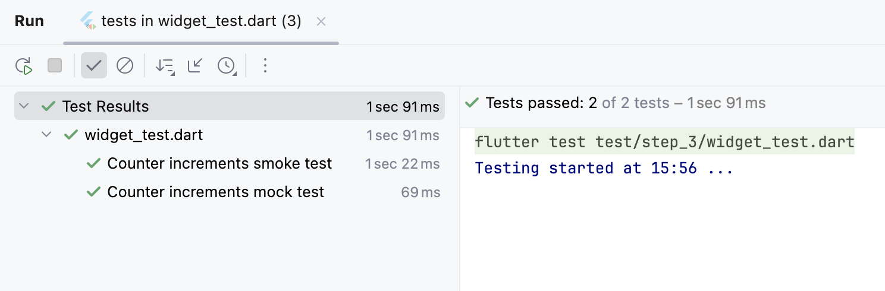

# step.3:カウンター機能(状態オブジェクト)を DIコンテナ対応にする。

- 依存を分離するため、カウンター機能（状態オブジェクト）を、DI コンテナから取得させます。
- 状態オブジェクトを直接生成（ハードコード）していないため、注入依存が差替可能になります。


## ハンズオン作業前のコード内容確認
ハンズオン作業前(コードの追加修正前)のコード内容は、`step_2` ハンズオン作業後をベースにしています。  
このため [lib/src/step_3/counter_page.dart](./counter_page.dart) と 
[lib/src/step_3/counter_di.dart](./counter_di.dart) には、`step_2` からのコード差分の追加修正を行います。

- IDEで、この`README.md`と同じディレクトリにある [lib/src/step_3/counter_di.dart](./counter_di.dart) と、  
  [lib/src/step_3/counter_page.dart](./counter_page.dart) を開いてください。  
  _`DartPad`を使われている方は、ブラウザで開いてください。_


## ハンズオン作業<br/>注入先クラスと DIコンテナに依存注入機能を追加する。

### カウンタ機能実装オブジェクト(依存元)の注入先クラスの定義

- IDEで [counter_di.dart](./counter_di.dart) を開いて、カウンタ機能実装オブジェクトを依存元とする注入先クラスを定義します。  
  _`DartPad`を使われている方は、ブラウザで [lib/src/step_2/dartpad.dart](./dartpad.dart) を開いて、_  
  _全コードをクリップボードにコピーしてから、ブラウザの [DartPad](https://dartpad.dev) にペーストしてください。_

`step_2`で、 依存元の`ReferencableCounter`インターフェースと  
実装の`CounterImpl`クラス、注入先の`InjectableCounter`インターフェースを定義したので、  
これから注入先の `CounterDouble`クラスを定義して、**外部からのメッセージを依存元に処理させるだけの`Proxy`** を作ることにします。  

注入先となる `CounterDouble`クラスには、依存元の`CounterImpl`オブジェクトが注入されるので、  
下記のように `ReferencableCounter`インターフェースと `InjectableCounter`インターフェースの実装が必要になります。

**【実装想定】**
```dart
/// DI から依存元を注入可能な Counter クラス
///
/// _機能実態が注入されるため、機能実現は注入元に任せ、_<br/>
/// _Analytics ログ出力などの機能仕様にない要件追加に利用できます。_<br/>
class CounterDouble implements ReferencableCounter, InjectableCounter {
}
```

ですが、`step_2`で説明したように、
DIコンテナのインフラ・ライブラリ([dependency_injector.dart](../infra/dependency_injector.dart))がありますので、  
外部からのメッセージを依存元に処理させるだけなら、下記のような最低限の実装で済みます。

**【新規追加】**
```dart
/// DI から依存元を注入可能な Counter クラス
///
/// _機能実態が注入されるため、機能実現は注入元に任せ、_<br/>
/// _Analytics ログ出力などの機能仕様にない要件追加に利用できます。_<br/>
class CounterDouble extends AbstractInjectable<ReferencableCounter> implements InjectableCounter {
  /// プライベート・コンストラクタ
  ///
  /// _DI コンテナを介してしか生成できないことに留意_
  CounterDouble._();

  @override
  int get count {
    return reference!.count;
  }

  @override
  set count(int value) => reference!.count = value;

  @override
  void increment() => reference!.increment();
}
```


### DIコンテナの createメソッドに依存注入コードを追加

`step_2`では、  
DIコンテナ(`CounterDiContainer`)の`create`メソッドに**依存元オブジェクトの生成**と **コンテナへの保持管理**を実装しています。  
注入先クラスを定義したので、メソッドに **注入先オブジェクトの生成**と **依存元オブジェクトの注入** を追加するコード修正を行います。  

**【修正前】**
```dart
  /// Counter オブジェクト生成
  @override
  Counter create() {
    // オブジェクトを生成しますが、Dependency Inject は利用できません。
    CounterImpl counter = CounterImpl._();
    super.addContainer(counter.id, counter);
    return counter;
  }
```

**【修正後】**
```dart
  /// Counter オブジェクト生成
  @override
  Counter create() {
    if (!checkDebugMode(isThrowError: false)) {
      // デバッグモードでないので Dependency Inject を利用させません。
      CounterImpl counter = CounterImpl._();
      return counter;
    }
    // デバッグモードの場合のみ Dependency Inject 可能にします。
    CounterDouble counter = CounterDouble._();
    CounterImpl inject = CounterImpl._();
    counter.init(inject);
    super.addContainer(counter.id, counter);
    return counter;
  }
```


## ハンズオン作業後のアプリ実行
- FAB(`+`)をタップすると、画面中央のカウント値が＋１されます。

_DIコンテナによりカウンタ機能オブジェクト(**依存元**と**注入先**)が生成され、アプリには**注入先**がバインドされますが、_  
_**依存元**も **注入先**も、カウンタ機能はオリジナルと変わないので、挙動は `step_1`や `step_2`と変わりません。_  

- 実行できなかった場合は、  
  ハンズオン作業後の `step_3`のコードと
  ハンズオン完成コード（[lib/src/step_di_injectable/](../step_di_injectable/)）と比較してみてください。


## テストコード確認
ブラウザか IDEで、`step_3`のテストコード ⇒ [test/step_3/widget_test.dart](../../../test/step_3/widget_test.dart) を確認します。


### テストコード確認ポイント
カウンタ機能オブジェクトの注入先クラスが追加され、DIコンテナも依存注入ができるようになりました。  
この DIコンテナの特色として、依存元(カウンタ機能オブジェクト)を動的に差し替えることもできます。

テストコードでは、アプリで生成されたカウンタ機能オブジェクトと テスト用モックのオブジェクトとを差し替え、  
テストコードからモックのカウンタ値を `99`に設定することで、  
課題として上げていた **「カウント値が 100になったときのテスト」** を行っています。

この対応のために、`MockCounter`クラスと、`testWidgets('Counter increments mock test'`パターンを追加しています。

**【新規追加】**
```dart
/// DI コンテナを介して参照可能で、動的注入されるモックオブジェクト
///
/// _テストコードから値読み出しや状態更新など操作可能_
class MockCounter extends AbstractReferencable implements ReferencableCounter {
  // ignore: prefer_final_fields
  late int? _value;

  MockCounter();

  @override
  int get count => _value!;

  @override
  set count(int value) => _value = value;

  @override
  void increment() => count++;
}
```

**【新規追加】**
```dart
  testWidgets('Counter increments mock test', (WidgetTester tester) async {
    // Build our app and trigger a frame.
    await tester.pumpWidget(const MyApp());

    CounterDiContainer di = CounterDiContainer.singleton;
    int id = di.listUpIds().first;

    MockCounter mock = MockCounter();
    di.swapReference(id, mock);

    // Verify that our counter starts at 0.
    expect(find.text('0'), findsOneWidget);
    expect(find.text('1'), findsNothing);

    // Tap the '+' icon and trigger a frame.
    mock.count = 99;
    await tester.tap(find.byIcon(Icons.add));
    await tester.pump();

    // Verify that our counter has incremented.
    expect(find.text('0'), findsNothing);
    expect(find.text('1'), findsNothing);
    expect(find.text('100'), findsOneWidget);
  });
```


### テストコード実行

テスト実行結果  

- テストに成功した事はわかりますが、テストされたときのカウント値はわかりません。

- テストに失敗した場合は、  
  ハンズオン作業後の `step_3`のコードと
  ハンズオン完成コード（[lib/src/step_di_injectable/](../step_di_injectable/)）とを比較してみてください。


## 課題
1. テストに成功した事はわかりますが、テストされたときのカウント値はわかりません。

2. ボイラープレート・コードは、将来的にマクロなどでの自動生成が必要でしょう。
