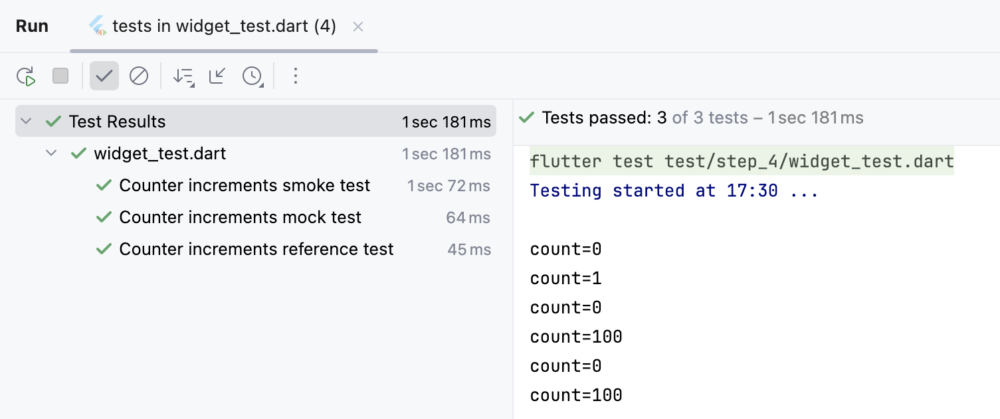

# step.4:DIコンテナの応用例として、機能仕様にない要件に対応する。

- 依存を分離するため、カウンター機能（状態オブジェクト）を、DI コンテナから取得させます。
- 状態オブジェクトを直接生成（ハードコード）していないため、注入依存が差替可能になります。
- このDIコンテナは、依存元と注入先を指定でき、依存元にない要件を注入先に分離追加できます。


## ハンズオン作業前のコード内容確認
ハンズオン作業前(コードの追加修正前)のコード内容は、`step_3` ハンズオン作業後をベースにしています。  
このため [lib/src/step_4/counter_page.dart](./counter_page.dart) と
[lib/src/step_4/counter_di.dart](./counter_di.dart) に、`step_3`からの差分実装をこれから行います。

- IDEで、この`README.md`と同じディレクトリにある [lib/src/step_4/counter_di.dart](./counter_di.dart) と、  
  [lib/src/step_4/counter_page.dart](./counter_page.dart) を開いてください。  
  _`DartPad`を使われている方は、ブラウザで開いてください。_


## ハンズオン作業<br/>注入先クラスに、機能仕様にない要件を追加する。

### 注入先クラスに、カウンタ値のログ出力を追加

- IDEで [counter_di.dart](./counter_di.dart) を開いて、カウンタ機能実装オブジェクトを依存元とする注入先クラスを修正します。  
  _`DartPad`を使われている方は、ブラウザで [lib/src/step_4/dartpad.dart](./dartpad.dart) を開いて、_  
  _全コードをクリップボードにコピーしてから、ブラウザの [DartPad](https://dartpad.dev) にペーストしてください。_  

DIコンテナ(`CounterDiContainer`)では、依存元を注入先に依存注入させる作りになっています。  

このためカウンタ値のログ出力という「機能仕様にない追加要件に対応」するには、  
カウンタ機能を実装させた依存元でなく、注入先に「アプリからのカウンタ値読み出しで、カウンタ値をログ出力する」実装を追加します。  

_注入先への追加要件のコード追加により、  
**機能仕様によるカウンタ機能のコード**と **機能仕様にない追加要件のコード**が分離され、  
「追加要件の変更があっても、カウンタ機能のコードには影響を与えない」ことが保証されます。_  

アプリからのカウンタ値読み出しで、カウンタ値をログ出力するには、  
注入先クラス(`CounterDouble`)のカウンタ値`count`の `getter`にログ出力を追加するだけで済みます。  

**【修正前】**
```dart
  @override
  int get count {
    return reference!.count;
  }
```

**【修正後】**
```dart
  @override
  int get count {
    // デバッグ用に、機能仕様と関係のないカウント値のログ出力を追加
    debugLog('count=${reference!.count}');
    return reference!.count;
  }
```


## ハンズオン作業後のアプリ実行
- FAB(`+`)をタップすると、画面中央のカウント値が＋１されます。

_DIコンテナによりカウンタ機能オブジェクト(**依存元**と**注入先**)が生成され、アプリには**注入先**がバインドされます。_  
_`step_4`では、**依存元**のカウンタ機能はオリジナルと変わりませんが、**注入先**のカウント値の `getter`にログ出力が追加されています。_  

_これは、**カウンタ機能のコード変更をすることなく、機能仕様でない追加要件に対応した** ことを示します。_  
_またカウンタ機能の挙動は、これまで通り `step_1`〜`step_3`と変わりません。_  

- 実行できなかった場合は、  
  ハンズオン作業後の `step_4`のコードと
  ハンズオン完成コード（[lib/src/step_di_usage/](../step_di_usage/)）と比較してみてください。


## テストコード確認
ブラウザか IDEで、`step_4`のテストコード ⇒ [test/step_4/widget_test.dart](../../../test/step_4/widget_test.dart) を確認します。


### テストコード確認ポイント
カウンタ機能オブジェクトの注入先クラスが追加され、DIコンテナも依存注入ができるようになりました。  
この DIコンテナの特色として、依存元(カウンタ機能オブジェクト)を動的に参照することもできます。

テストコードでは、**アプリで生成されたカウンタ機能オブジェクトの参照をテスト内から取得** して、  
モックを作ることなく、テストコード内から参照先のカウンタ値を `99`に設定することで、  
課題として上げていた **「カウント値が 100になったときのテスト」** も行っています。

この対応のために、`testWidgets('Counter increments reference test'`パターンを追加しています。

**【新規追加】**
```dart
  testWidgets('Counter increments reference test', (WidgetTester tester) async {
    // Build our app and trigger a frame.
    await tester.pumpWidget(const MyApp());

    CounterDiContainer di = CounterDiContainer.singleton;
    int id = di.listUpIds().first;

    // アプリ内で生成された、カウンタ機能オブジェクトの参照を取得する。
    Injectable<ReferencableCounter> injector = di.getInjector(id);
    ReferencableCounter reference = injector.reference!;

    // Verify that our counter starts at 0.
    expect(find.text('0'), findsOneWidget);
    expect(find.text('1'), findsNothing);

    // Tap the '+' icon and trigger a frame.
    reference.count = 99;
    await tester.tap(find.byIcon(Icons.add));
    await tester.pump();

    // Verify that our counter has incremented.
    expect(find.text('0'), findsNothing);
    expect(find.text('1'), findsNothing);
    expect(find.text('100'), findsOneWidget);
  });
```

テストコードでは、「注入先は依存元の参照機能も持っている」ことを利用した、  
**注入先の依存元と(自身に依存元が注入された) 追加の注入先オブジェクトとを差し替える、多段階の入れ子の依存注入**により、  
テストコード内から参照先のカウンタ値を `99`に設定したり、`FABタップのイベントのログ出力`によりテストアクションを見えるようにする、  
**「カウント値が 100になったときのテスト」** と **「依存元も注入先のコードも変更することなく、追加要件に対応するテスト」** も行っています。  

この対応のために、`DarkMagicCounter`クラスと、`testWidgets('Counter increments dark magic test'`パターンを追加しています。

**【新規追加】**
```dart
/// 自身に依存元が注入され、注入先の依存元として差し替えられる「多段階の入れ子注入先」
class DarkMagicCounter extends AbstractInjectable<ReferencableCounter>
        implements InjectableCounter {
  DarkMagicCounter();

  @override
  int get count {
    return reference!.count;
  }

  @override
  set count(int value) => reference!.count = value;

  @override
  void increment() {
    reference!.increment();
    debugLog('increment!');
  }
}
```

**【新規追加】**
```dart
  testWidgets('Counter increments dark magic test',
      (WidgetTester tester) async {
    // Build our app and trigger a frame.
    await tester.pumpWidget(const MyApp());

    CounterDiContainer di = CounterDiContainer.singleton;
    int id = di.listUpIds().first;

    // アプリ内で生成された、カウンタ機能オブジェクトの参照を取得する。
    Injectable<ReferencableCounter> injector = di.getInjector(id);
    ReferencableCounter reference = injector.reference!;

    // Dark Magic に、カウンタ機能オブジェクトの参照（依存元）を注入する。
    DarkMagicCounter magic = DarkMagicCounter();
    magic.init(reference);

    // 注入先の依存元を Dark Magic と差し替える。
    injector.swap(magic);

    // Verify that our counter starts at 0.
    expect(find.text('0'), findsOneWidget);
    expect(find.text('1'), findsNothing);

    // Tap the '+' icon and trigger a frame.
    magic.count = 99;
    await tester.tap(find.byIcon(Icons.add));
    await tester.pump();

    // Verify that our counter has incremented.
    expect(find.text('0'), findsNothing);
    expect(find.text('1'), findsNothing);
    expect(find.text('100'), findsOneWidget);

    // 後始末
    injector.swap(reference);
    magic.dispose();
  });
```


### テストコード実行

テスト実行結果  

- テストに成功した事がわかるだけでなく、テストされたときのカウント値がログ出力されています。  
  _ログ出力の count=0, 1, 0, 100, 0, 100, 0, 100, increment! は、4つのテストから、2回づつカウント値が読み出され、_  
  _テストタイトル smokeでは 0と1、mockでは 0と100、referenceでは 0と100、dark magicでは 0と100 の値の読み出しと、_  
  _dark magicで FABタップのログが出力されたことを示します。_

- _`dark magic`パターンは、**注入先の依存元と(自身に依存元が注入された) 追加の注入先オブジェクトとを差し替える、多段階の入れ子の依存注入**により、
`FABタップでログ出力する`という **依存元も注入先のコードも変更することなく、追加要件を満たせる** ことを示します。_  
_この **多段階依存注入パターンは、DIコンテナの`create`メソッドでも利用できる** ことに留意ください。_

- テストに失敗した場合は、  
  ハンズオン作業後の `step_4`のコードと
  ハンズオン完成コード（[lib/src/step_di_usage/](../step_di_usage/)）とを比較してみてください。


## 課題
1. 動的な依存注入や依存元の差替は、リリースモードでは禁止する必要がある。
2. 動的な依存注入や依存元の差し替えでは、非同期処理での複数からの同時操作を防ぐため排他ロックが必要でしょう。
3. ボイラープレート・コードは、将来的にマクロなどでの自動生成が必要でしょう。


## 次のステップ（まとめ）へ
こちらから [step_5](../step_5/README.md) の「ミニハンズオンまとめ」に進んでください。
