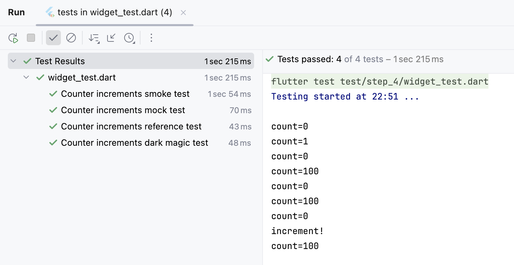

# step.4:DIコンテナの応用例として、機能仕様にない要件に対応する。

- 依存を分離するため、カウンター機能（状態オブジェクト）を、DI コンテナから取得させます。
- 状態オブジェクトを直接生成（ハードコード）していないため、注入依存が差替可能になります。
- このDIコンテナは、依存元と注入先を指定でき、依存元にない要件を注入先に分離追加できます。


## ハンズオン作業前のコード内容確認
ハンズオン作業前(コードの追加修正前)のコード内容は、`step_3` ハンズオン作業後をベースにしています。  
このため [lib/src/step_4/counter_page.dart](./counter_page.dart) と
[lib/src/step_4/counter_di.dart](./counter_di.dart) に、`step_3`からの差分実装をこれから行います。

- IDEで、この`README.md`と同じディレクトリにある [lib/src/step_4/counter_di.dart](./counter_di.dart) と、  
  [lib/src/step_4/counter_page.dart](./counter_page.dart) を開いてください。  
  _`DartPad`を使われている方は、ブラウザで開いてください。_


## ハンズオン作業<br/>DIコンテナや注入先クラスに、機能仕様にない要件を追加する。

### 注入先クラスに、カウンタ値のログ出力を追加

- IDEで [counter_di.dart](./counter_di.dart) を開いて、カウンタ機能実装オブジェクトを依存元とする注入先クラスを修正します。  
  _`DartPad`を使われている方は、ブラウザで [lib/src/step_4/dartpad.dart](./dartpad.dart) を開いて、_  
  _全コードをクリップボードにコピーしてから、ブラウザの [DartPad](https://dartpad.dev) にペーストしてください。_  

DIコンテナ(`CounterDiContainer`)では、依存元を注入先に依存注入させる作りになっています。  

このためカウンタ値のログ出力という「機能仕様にない追加要件に対応」するには、  
カウンタ機能を実装させた依存元でなく、注入先に「アプリからのカウンタ値読み出しで、カウンタ値をログ出力する」実装を追加します。  

_注入先への追加要件のコード追加により、  
**機能仕様によるカウンタ機能のコード**と **機能仕様にない追加要件のコード**が分離され、  
「追加要件の変更があっても、カウンタ機能のコードには影響を与えない」ことが保証されます。_  

アプリからのカウンタ値読み出しで、カウンタ値をログ出力するには、  
注入先クラス(`CounterDouble`)のカウンタ値`count`の `getter`にログ出力を追加するだけで済みます。  

**【修正前】**
```dart
  @override
  int get count {
    return reference!.count;
  }
```

**【修正後】**
```dart
  @override
  int get count {
    // デバッグ用に、機能仕様と関係のないカウント値のログ出力を追加
    debugLog('count=${reference!.count}');
    return reference!.count;
  }
```


### DIコンテナに、依存注入の禁止設定を追加（オプション）

`step_3`の実装でもリリースモードでビルドすれば、依存注入が自動的に無視(禁止)されます。  
ですがリリースモードでビルドするまで「アプリ内での DIコンテナ・注入先操作」が見落されないようフラグを追加してみます。  

DIコンテナ(`CounterDouble`)のオブジェクトは、シングルトンにしているため、  
クラスの最上行に静的フラグ `isForbiddenInject`を追加します。  

**【新規追加】**
```dart
  /// 注入禁止要請フラグ
  static bool isForbiddenInject = false;
```

DIコンテナ(`CounterDouble`)の依存注入は、`create`メソッドで行っているので、  
依存注入禁止 ⇒ Dependency Inject を利用させない条件に `isForbiddenInject`を追加します。  

**【修正前】**
```dart
  /// Counter オブジェクト生成
  @override
  Counter create() {
    if (!checkDebugMode(isThrowError: false)) {
      // デバッグモードでないので Dependency Inject を利用させません。
      CounterImpl counter = CounterImpl._();
      return counter;
    }
    // デバッグモードの場合のみ Dependency Inject 可能にします。
    /* 〜 省略 〜 */
    return counter;
  }
```

**【修正後】**
```dart
  /// Counter オブジェクト生成
  @override
  Counter create() {
    if (!checkDebugMode(isThrowError: false) || isForbiddenInject) {
      // デバッグモードでないか注入禁止なので Dependency Inject を利用させません。
      CounterImpl counter = CounterImpl._();
      return counter;
    }
    // デバッグモードの場合のみ Dependency Inject 可能にします。
    /* 〜 省略 〜 */
    return counter;
  }
```


## ハンズオン作業後のアプリ実行
- FAB(`+`)をタップすると、画面中央のカウント値が＋１されます。

_DIコンテナによりカウンタ機能オブジェクト(**依存元**と**注入先**)が生成され、アプリには**注入先**がバインドされます。_  
_`step_4`では、**依存元**のカウンタ機能はオリジナルと変わりませんが、**注入先**のカウント値の `getter`にログ出力が追加されています。_  

_これは、**カウンタ機能のコード変更をすることなく、機能仕様でない追加要件に対応した** ことを示します。_  
_またカウンタ機能の挙動は、これまで通り `step_1`〜`step_3`と変わりません。_  

- 実行できなかった場合は、  
  ハンズオン作業後の `step_4`のコードと
  ハンズオン完成コード（[lib/src/step_di_usage/](../step_di_usage/)）と比較してみてください。


## テストコード確認
ブラウザか IDEで、`step_4`のテストコード ⇒ [test/step_4/widget_test.dart](../../../test/step_4/widget_test.dart) を確認します。


### テストコード確認ポイント
カウンタ機能オブジェクトの注入先クラスが追加され、DIコンテナも依存注入ができるようになりました。  
この DIコンテナの特色として、依存元(カウンタ機能オブジェクト)を動的に参照することもできます。

テストコードでは、**アプリで生成されたカウンタ機能オブジェクトの参照をテスト内から取得** して、  
モックを作ることなく、テストコード内から参照先のカウンタ値を `99`に設定することで、  
課題として上げていた **「カウント値が 100になったときのテスト」** も行っています。

この対応のために、`testWidgets('Counter increments reference test'`パターンを追加しています。

**【新規追加】**
```dart
  testWidgets('Counter increments reference test', (WidgetTester tester) async {
    // Build our app and trigger a frame.
    await tester.pumpWidget(const MyApp());

    CounterDiContainer di = CounterDiContainer.singleton;
    int id = di.listUpIds().first;

    // アプリ内で生成された、カウンタ機能オブジェクトの参照を取得する。
    Injectable<ReferencableCounter> injector = di.getInjector(id);
    ReferencableCounter reference = injector.reference!;

    // Verify that our counter starts at 0.
    expect(find.text('0'), findsOneWidget);
    expect(find.text('1'), findsNothing);

    // Tap the '+' icon and trigger a frame.
    reference.count = 99;
    await tester.tap(find.byIcon(Icons.add));
    await tester.pump();

    // Verify that our counter has incremented.
    expect(find.text('0'), findsNothing);
    expect(find.text('1'), findsNothing);
    expect(find.text('100'), findsOneWidget);
  });
```


### テストコード実行

テスト実行結果  

- テストに成功した事がわかるだけでなく、テストされたときのカウント値がログ出力されています。  
  _ログ出力の count=0, 1, 0, 100, 0, 100 は、3つのテストから、2回づつカウント値が読み出され、_  
  _テストタイトル smokeでは 0と1、mockでは 0と100、referenceでは 0と100 の値が読み出されたことを示します。_  

- テストに失敗した場合は、  
  ハンズオン作業後の `step_4`のコードと
  ハンズオン完成コード（[lib/src/step_di_usage/](../step_di_usage/)）とを比較してみてください。


## 課題
1. ボイラープレート・コードは、将来的にマクロなどでの自動生成が必要でしょう。
