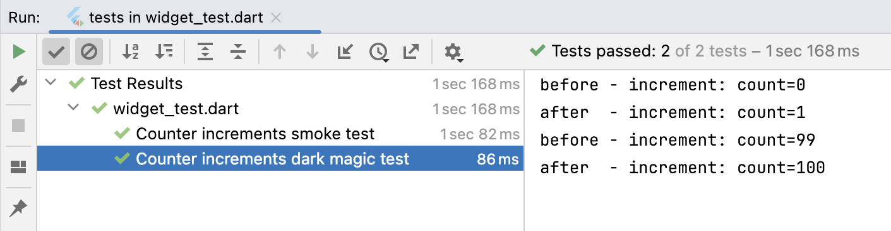

# step.4 di use example:多段階依存注入パターンの使用例。

- 依存元やオリジナルの注入先を変更することなく、依存元にない要件追加を行うサンプルです。
- 開発時限定となりますが、多段階依存注入を使って、処理前後のデバッグ出力機能を追加します。
- このステップでの作業は、動作確認のためのコメントアウト ON/OFF のみで修正はありません。 


## ハンズオン作業前のコード内容確認
ハンズオン作業前(コードの追加修正前)のコード内容は、`step_3` ハンズオン作業後をベースにしていますが、  
[lib/src/step_4_di_use_example/counter_page.dart](./counter_page.dart) と
[lib/src/step_4_di_use_example/counter_di.dart](./counter_di.dart) および  
[lib/src/step_4_di_use_example/additional_function.dart](./additional_function.dart) には、  
追加コードが（コメントアウト部を含めて）実装済みです。

- IDEで、この`README.md`と同じディレクトリにある [lib/src/step_4_di_use_example/counter_di.dart](./counter_di.dart) と、  
  [lib/src/step_4_di_use_example/counter_page.dart](./counter_page.dart) および  
  [lib/src/step_4_di_use_example/additional_function.dart](./additional_function.dart) を開いてください。  
  _`DartPad`を使われている方は、ブラウザで開いてください。_


## ハンズオン作業<br/>DIコンテナと カウンタ画面と 追加要件のコードを確認する。

### DIコンテナの 追加コード(mount と unmountメソッド)を確認
- IDEで [counter_di.dart](./counter_di.dart) を開いて、
  DIコンテナ(`CounterDiContainer`)に追加された、`mount`と`unmount`メソッドを確認してください。  
  _`DartPad`を使われている方は、ブラウザで [dartpad.dart](./dartpad.dart) を開いて、_  
  _全コードをクリップボードにコピーしてから、ブラウザの [DartPad](https://dartpad.dev) にペーストしてください。_

**【mount】**
```dart
/// （追加機能）注入先の依存元に、Injectableオブジェクトをマウントさせる。
Counter mount(int id, InjectableCounter mounting) {
  InjectableCounter orgInjector = getInjector(id);
  ReferencableCounter reference = orgInjector.reference!;
  mounting.init(reference);
  orgInjector.swap(mounting);
  return mounting;
}
```

**【unmount】**
```dart
/// （追加機能）注入先の依存元から、Injectableオブジェクトをアンマウントする。
void unmount(int id) {
  InjectableCounter orgInjector = getInjector(id);
  InjectableCounter mounting = (orgInjector.reference! as InjectableCounter);
  ReferencableCounter reference = mounting.reference!;
  orgInjector.swap(reference);
  mounting.dispose();
}
```


### カウンタ画面における、多段階依存注入対応を確認
- IDEで [counter_page.dart](./counter_page.dart) を開いて、
  `_MyHomePageState`のコメントアウト実装が追加された、`initState`と`dispose`メソッドを確認してください。  
  _`DartPad`を使われている方は、引き続きブラウザで作業を続けてください。_

**【initState】**
```dart
  @override
  void initState() {
    super.initState();
    var di = CounterDiContainer.singleton;
    _counter = di.create();
    /*
    // 依存元のカウンタ状態に Dark Magicをマウントする
    int id = di.listUpIds().first;
    DarkMagicCounter magic = DarkMagicCounter();
    di.mount(id, magic);
    */
  }
```

**【dispose】**
```dart
  @override
  void dispose() {
    var di = CounterDiContainer.singleton;
    /*
    // 依存元のカウンタ状態から Dark Magicをアンマウントする
    int id = di.listUpIds().first;
    di.unmount(id);
    */
    di.deleteAll();
    super.dispose();
  }
```


### 追加要件に対応する、注入先クラスを確認
- IDEで [additional_function.dart](./additional_function.dart) を開いて、
  依存元に注入する追加要件の`DarkMagicCounter`クラスを確認してください。  
  _`DartPad`を使われている方は、引き続きブラウザで作業を続けてください。_

**【DarkMagicCounter】**
```dart
/// 自身に依存元が注入され、注入先の依存元として差し替えられる「多段階の入れ子注入先」
class DarkMagicCounter extends AbstractInjectable<ReferencableCounter> implements InjectableCounter {
  DarkMagicCounter();

  @override
  int get count {
    return reference!.count;
  }

  @override
  set count(int value) => reference!.count = value;

  @override
  void increment() {
    // increment 実行前後の counter値をログ出力する。
    debugLog('before - increment: count=$count');
    reference!.increment();
    debugLog('after  - increment: count=$count');
  }
}
```


## テストコード確認
ブラウザか IDEで、`step_4_di_use_example`のテストコード ⇒ [test/step_4_di_use_example/widget_test.dart](../../../test/step_4/widget_test.dart) を確認します。


### テストコードを確認
多段階依存注入パターンの対応のために、`testWidgets('Counter increments dark magic test'`パターンを追加しています。

**【dark magic test】**
```dart
  testWidgets('Counter increments dark magic test', (WidgetTester tester) async {
    // Build our app and trigger a frame.
    await tester.pumpWidget(const MyApp());

    // 簡易DIコンテナから、カウンタ機能オブジェクトの参照（依存元） IDを取得する。
    CounterDiContainer di = CounterDiContainer.singleton;
    int id = di.listUpIds().first;

    // 簡易DIコンテナで、カウンタ機能オブジェクトの参照（依存元）を Dark Magic に注入する。
    DarkMagicCounter magic = DarkMagicCounter();
    di.mount(id, magic);

    // Verify that our counter starts at 0.
    expect(find.text('0'), findsOneWidget);
    expect(find.text('1'), findsNothing);

    // Tap the '+' icon and trigger a frame.
    await tester.tap(find.byIcon(Icons.add));
    await tester.pump();

    // Verify that our counter has incremented.
    expect(find.text('0'), findsNothing);
    expect(find.text('1'), findsOneWidget);

    // Tap the '+' icon and trigger a frame.
    magic.count = 99;
    await tester.tap(find.byIcon(Icons.add));
    await tester.pump();

    // Verify that our counter has incremented.
    expect(find.text('0'), findsNothing);
    expect(find.text('1'), findsNothing);
    expect(find.text('100'), findsOneWidget);

    // 後始末
    di.unmount(id);
  });
```


### テストコード実行

テスト実行結果  



- テストに成功した事がわかるだけでなく、`dark magic`パターンでは、インクリメント前後のカウント値がログ出力されています。  
  _ログ出力の before - increment: count= と after  - increment: count= の 0, 1, 99, 100 は、
  FABタップの前と後のカウント値が出力されたことを示します。_


## コード確認後のアプリ実行
- `MyHomePageState`クラスの `initState`と `dispose`メソッドがコメントアウトのままで、FAB(`+`)をタップすると、  
  画面中央のカウント値が＋１されるだけにとどまります。

- `MyHomePageState`クラスの `initState`と `dispose`メソッドのコメントアウトを外して、FAB(`+`)をタップすると、  
  画面中央のカウント値の＋１だけでなく、処理前後のカウント値が出力されます。


## 注意事項
1. 使用例で追加された動的な依存注入や依存元の差替は、リリースモードではエラーとなります。


## 次のステップ（まとめ）へ
こちらから [step_5](../step_5/README.md) の「ミニハンズオンまとめ」に進んでください。
